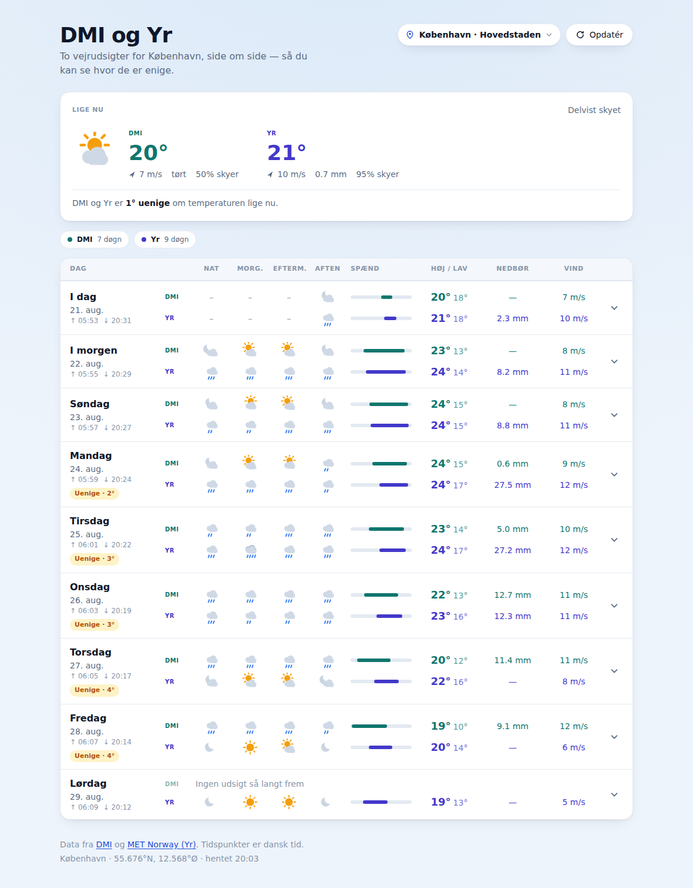
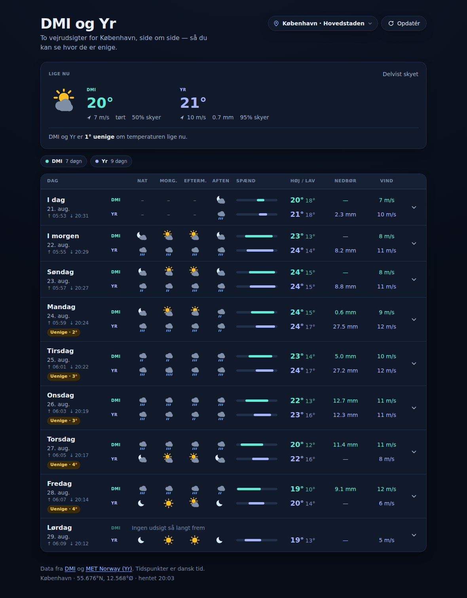

# DMI og Yr

Two weather forecasts for the same Danish town, side by side, hour by hour — so
you can see where the Danish Meteorological Institute and MET Norway's Yr
disagree.

A forecast on its own tells you what to expect. Two forecasts tell you how much
to trust it, which is the question this app is built to answer: every day row
carries both providers' numbers and, where they part company by a degree or
more, says so.

<p align="center">
  
  
</p>

## Getting started

```bash
pnpm install
pnpm dev            # http://localhost:3000
```

Neither provider needs an API key. DMI's open data moved to
`opendataapi.dmi.dk`, which is unauthenticated; MET Norway asks only for an
identifying `User-Agent`.

### Working offline

```bash
pnpm dev:mock       # serves generated fixtures, never touches the network
```

`WEATHER_MOCK=1` swaps both upstream calls for synthetic responses in the exact
upstream wire format — Kelvin and cloud fractions for DMI, Celsius and symbol
codes for Yr. Everything downstream of the network hop runs for real, so it is
a faithful way to develop and test without depending on two public services
being reachable and in a good mood.

### Configuration

| Variable | Required | Purpose |
| --- | --- | --- |
| `WEATHER_CONTACT` | For production | Contact address embedded in the `User-Agent` sent to MET Norway, as [their terms require](https://developer.yr.no/doc/TermsOfService/). Defaults to this repository's URL. |
| `WEATHER_MOCK` | No | Set to `1` to serve fixtures instead of calling the providers. |

Copy `.env.example` to `.env.local` to set them.

## Commands

```bash
pnpm dev            # development server
pnpm dev:mock       # development server on fixtures
pnpm build          # production build
pnpm start          # serve the production build
pnpm lint           # Biome lint and format check
pnpm typecheck      # tsc --noEmit
pnpm test           # Vitest
pnpm check          # lint + typecheck + test, what CI runs
```

## How it fits together

```
app/
├── api/
│   ├── dmi/route.ts        # GET /api/dmi?location=<id>
│   └── yr/route.ts         # GET /api/yr?location=<id>
├── components/             # the UI, split by responsibility
│   ├── forecast.tsx        # fetching, state, page composition
│   ├── day-card.tsx        # a day row and its hourly table
│   ├── now-panel.tsx       # the "right now" headline
│   ├── location-picker.tsx
│   ├── weather-icon.tsx    # inline SVG icon set
│   └── ui.tsx              # shared primitives and provider styling
└── page.tsx                # reads ?sted= and renders the client app

lib/weather/
├── types.ts                # HourlyForecast, the shared shape
├── time.ts                 # everything timezone-aware
├── sun.ts                  # sunrise/sunset, computed locally
├── conditions.ts           # the closed set of weather conditions
├── aggregate.ts            # grouping, day summaries, provider spread
├── cache.ts                # TTL cache with stale-on-error
├── service.ts              # fetch, normalise, cache, degrade
├── locations.ts            # the towns you can pick
├── mock.ts                 # fixture generation for WEATHER_MOCK
└── providers/
    ├── dmi.ts              # DMI request building and normalisation
    └── yr.ts               # Yr request building and normalisation
```

### The normalised hour

Both providers are reduced to one shape before anything renders:

```ts
type HourlyForecast = {
  time: string;          // ISO-8601 UTC instant
  day: string;           // "YYYY-MM-DD" in Europe/Copenhagen
  hour: number;          // 0-23 in Europe/Copenhagen
  temperature: number;   // °C
  precipitation: number; // mm over `coversHours`
  windSpeed: number;     // m/s
  windDirection: number; // degrees the wind blows *from*
  cloudCover: number;    // %
  humidity: number;      // %
  symbol?: string;       // Yr's own code, where there is one
  coversHours: number;   // 1 hourly, 6 once Yr coarsens
};
```

`day` and `hour` are resolved in `Europe/Copenhagen`, not in the viewer's
timezone. A Danish forecast has Danish days regardless of where it is read
from, and pinning it also keeps the server and client renders identical.

### Design notes

**Sunrise and sunset are computed, not fetched.** `lib/weather/sun.ts`
implements the NOAA solar equations, which agree with published Copenhagen
times to within a minute. That removes seven network round-trips per page load,
removes the failure mode where a slow sunrise API left the whole forecast
blank, and removes a hardcoded `+01:00` offset that was an hour wrong for half
the year.

**Precipitation is handled by rate, not by total.** Yr reports six-hourly
blocks past the first couple of days, so every entry carries `coversHours` and
anything that compares precipitation divides by it first. Otherwise a wet
afternoon and a drizzly day look the same.

**DMI's accumulation is detected rather than assumed.** DMI's documentation is
ambiguous about whether `total-precipitation` arrives per step or accumulated
over the forecast, so `deaccumulate()` looks: a series that never once
decreases across a week is accumulated and gets differenced, and anything else
is passed through untouched.

**A provider that fails degrades, it does not take the page down.** The service
keeps the last good response for up to twelve hours and serves it with a
`stale` marker, which the UI shows as a banner. Each provider loads, fails and
retries independently, so one being down still leaves you a forecast.

**Colour is never the only signal.** Every number carries a `DMI` or `Yr` tag
rather than relying on teal versus indigo.

## Providers

|  | DMI | Yr |
| --- | --- | --- |
| Model | HARMONIE DINI SF | ECMWF / MEPS |
| Horizon | 7 days | 9 days |
| Resolution | Hourly | Hourly, then 6-hourly |
| Coverage | Nordic region | Global |
| Auth | None | Identifying `User-Agent` |
| Temperature | Kelvin | Celsius |
| Cloud cover | Fraction 0–1 | Percent 0–100 |
| Weather symbols | None | Yes |
| Docs | [DMI](https://opendatadocs.dmi.govcloud.dk/) | [Yr](https://developer.yr.no/) |

The location list is deliberately a fixed set of Danish towns rather than a
free-text geocoder: DMI's model only covers the Nordic region, so anywhere it
cannot forecast would defeat the comparison.

## Deploying

The forecast cache in `lib/weather/cache.ts` lives in module memory, which
means one cache per server instance and nothing surviving a cold start. That is
fine for a single instance; behind more than one, move it to Redis or the
platform's own data cache. The interface is small on purpose.

Set `WEATHER_CONTACT` before deploying, so MET Norway can reach whoever is
running it.

## Licence

MIT.
